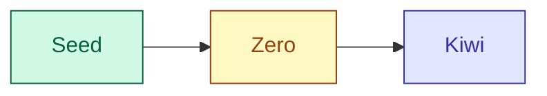

# Codfish

## Versions Overview

| 🇬🇧 **English** | 🇵🇹 **Português** |
| --- | --- |
| **Codfish** is a text analysis tool for **SEO optimization in Portuguese**, available in three build levels — from a minimal seed version to advanced pre-production builds. | O **Codfish** é uma ferramenta de análise de texto e **otimização SEO em português**, disponível em três níveis de build — desde o esboço inicial a versões de pré-produção mais avançadas. |

---

## Versions

| 🇬🇧 **Version** | 🇵🇹 **Versão** | Description / Descrição |
| --- | --- | --- |
| **Seed** (v0.1) | **Seed** (v0.1) | **EN:** Minimal static HTML + JS build with basic metrics: word/sentence count, keyword density, Flesch-Kincaid score, passive voice detection, and reading level. No styling framework. **PT:** Build estático mínimo em HTML + JS com métricas básicas: contagem de palavras/frases, densidade de palavras-chave, índice Flesch-Kincaid, deteção de voz passiva e nível de leitura. Sem framework de estilos. |
| **Zero - Dev Build** (v0.4) | **Zero** (v0.4) | **EN:** Written to work **without external dependencies** (no React, Tailwind, or third-party libraries). **PT:** Desenvolvido para funcionar **sem dependências externas** (sem React, Tailwind ou bibliotecas de terceiros). |
| **Kiwi - Dev Build** (v0.5.3) | **Kiwi** (v0.5.3) | **EN:** Non-minified static build with Tailwind CSS and JS kept readable for easy editing, includes source maps and full feature set. Heavier but fully editable. **PT:** Build estático não minificado com Tailwind CSS e JS mantidos legíveis para fácil edição, inclui *source maps* e conjunto completo de funcionalidades. Mais pesado mas totalmente editável. |

---

## Build Relationship Diagram

---

## Usage

| 🇬🇧 **English** | 🇵🇹 **Português** |
| --- | --- |
| 1. Download or clone the desired version. 2. Open `index.html` in your browser. 3. Enter text and keyword, then analyze. | 1. Fazer o download ou clonar a versão desejada. 2. Abrir `index.html` no navegador. 3. Inserir texto e keyword, depois analisar. |

---

## Author

Gonçalo Amaro @ 2025

## License

| 🇬🇧 **English** | 🇵🇹 **Português** |
| --- | --- |
| Part of a released product. **For demonstration purposes only.** | Todas as versões fazem parte de um produto final comercializado, cuja partilha foi devidamente autorizada. **Apenas para fins de demonstração.** |
